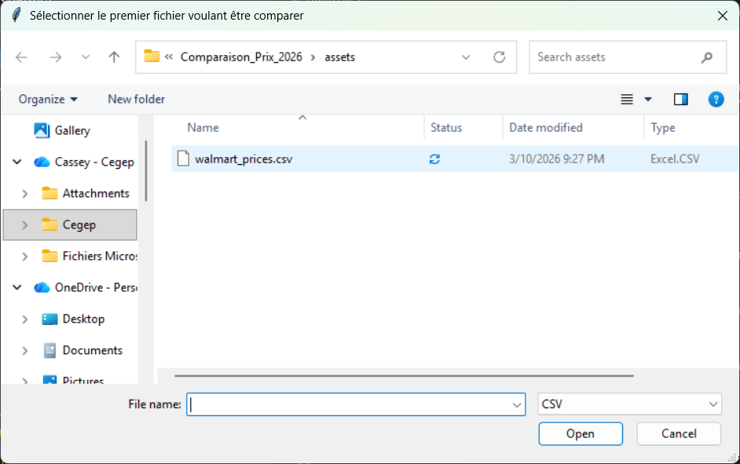
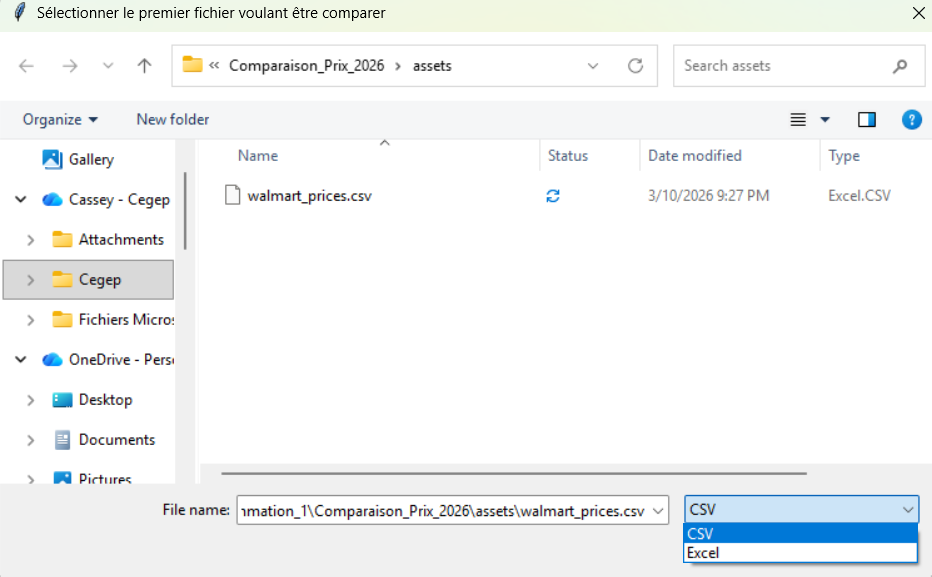

# Comparaison_Prix_2026

## Description

Comparaison de prix d'article entre deux fichiers qui peuvent être de format .xlsx ou .csv en fonction d'une recherche.
Donne la comparaison sous un fichier texte.

---
## Comment Effectuer
1. Installer Python
2. Installer VS Code
3. Ouvrir le projet dans VS code
4. Dans le terminal de VS code exécuter la commande: `pip install openpyxl`
5. Dans le terminal de VS code exécuter la commande: `pip install pandas`
6. Exécute main.py
7. Suivez les instructions jusqu'à l'obtention de l'analyse
---
## À prévoir
### Exécution de commande
Pour exécuter les commands, aller dans le terminal. Si vous ne le voyez pas il faut le glisser du bas de l'écran. Ensuite, tapez `pip install openpyxl`, et appuyez sur enter. Lorsque terminer répétez en tapant `pip install pandas` dans le terminal.
### Fichiers
Le programme vous demandera deux fichiers, ils peuvent être autant .xlsx ou .csv. Assurez-vous que l'entête respecte les normes dans la section *En tête des fichiers* pour obtenir un résultat adéquat. De plus, le programme vous demandera aussi l'emplacement souhaité de l'analyse. Ce fichier sera créer pour vous s'il n'existe pas déjà. Il est à noter que s'il existe déjà l'analyse sera écrite par dessus.  
### Navigateur de fichier
Dans le mode AJUSTABLE, voici l'explorateur de fichier à s'attendre à:   
### Naviguation du navigateur de fichier
Pour la sélection de fichier, clicker dessus les flèches pour voir les options présentes comme ceci:    
Ensuite, lorsque selectionner appuyer sur la case en bleu dans l'image au-dessus, celle à gauche pour enregistrer votre choix. Si vous le désirez, pour quitter l'exécution du programme, clicker sur la case à côté de celle-ci, à droite.

---
## En tête des fichiers
### Excel

L'excel doit être de format xlsx, les informations devraient se situer dans la première feuille et l'entête elle-même est ignorer. Par contre, les informations présente dans la première colonne devrait être les items(des mots) et dans la troisième colonne les prix correspondant(chiffres).  
Voici un exemple:  

### CSV
Le csv doit avoir l'extension .csv et l'entête, elle-même est ignorer. Par contre, les informations présente dans la première colonne devrait être les items(des mots) et dans la troisième colonne les prix correspondant(chiffres)  
Voici un exemple:  
 

---
## Auteurs

- Cassey Martin
- Karaboue Médjoua
- Ahmed Ait Hammou