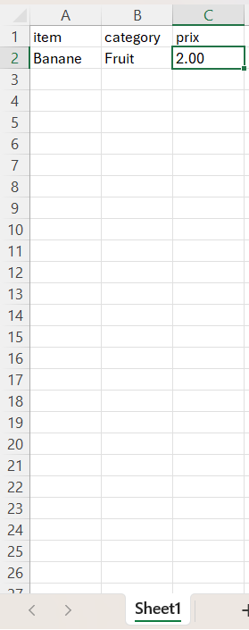
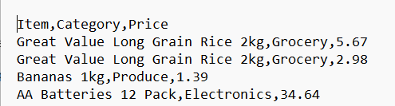

# Comparaison_Prix_2026

## Description

Comparaison de prix d'article entre deux fichiers qui peuvent être de format .xlsx ou .csv en fonction d'une recherche.
Donne la comparaison sous un fichier texte.

---
## Comment Effectuer
1. Installer Python
2. Installer VS Code
3. Ouvrir le projet dans VS code
4. Dans le terminal de VS code exécuter la commande: pip install openpyxl
5. Dans le terminal de VS code exécuter la commande: pip install pandas
6. Exécute main.py
7. Suivez les instructions jusqu'à l'obtention de l'analyse

---
## En tête des fichiers
### Excel

L'excel doit être de format xlsx, les informations devraient se situer dans la première feuille et l'entête elle-même est ignorer. Par contre, les informations présente dans la première colonne devrait être les items(des mots) et dans la troisième colonne les prix correspondant(chiffres).  
Voici un exemple:  

### CSV
Le csv doit avoir l'extension .csv et l'entête, elle-même est ignorer. Par contre, les informations présente dans la première colonne devrait être les items(des mots) et dans la troisième colonne les prix correspondant(chiffres)  
Voici un exemple:  
 

### À prévoir
Le programme vous demandera deux fichiers, ils peuvent être autant .xlsx ou .csv. Assurez-vous que l'entête respecte les normes précédantes pour obtenir un résultat adéquat. De plus, le programme vous demandera aussi l'emplacement souhaité de l'analyse. Ce fichier sera créer pour vous s'il n'existe pas déjà. Il est à noter que s'il existe déjà l'analyse sera écrite par dessus.

---
## Auteurs

- Cassey Martin
- Karaboue Médjoua
- Ahmed Ait Hammou